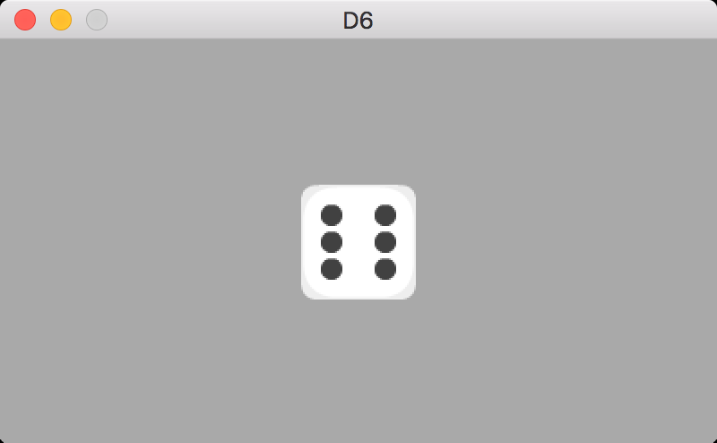
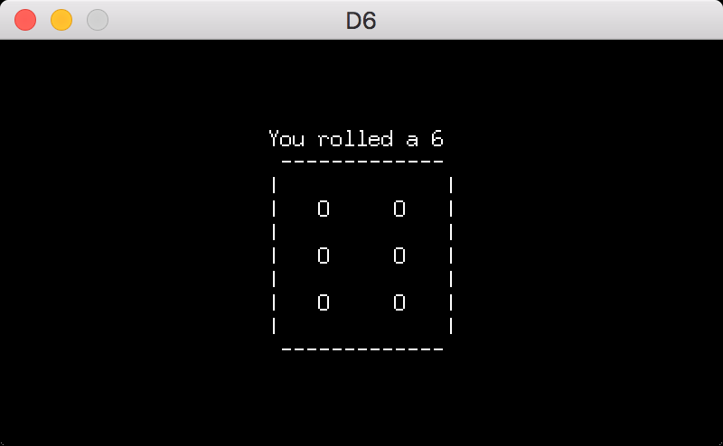

# Go Dice

[](https://goreportcard.com/report/github.com/miketmoore/go-dice)

## D6 GUI - Sprite Sheet

Roll one six-sided die via a GUI!



[Sprite Sheet Credit](http://kenney.nl/assets/boardgame-pack)

```
go run cmd/d6sprite/d6sprite.go
```

## D6 GUI - ASCII Art



Roll one six-sided die via a GUI!

```
go run cmd/d6/d6.go
```

## CLI Dice Rolling

Roll two twenty-sided dice (CLI)

```
go run cmd/dice/dice.go -total=2 -sides=20
```

